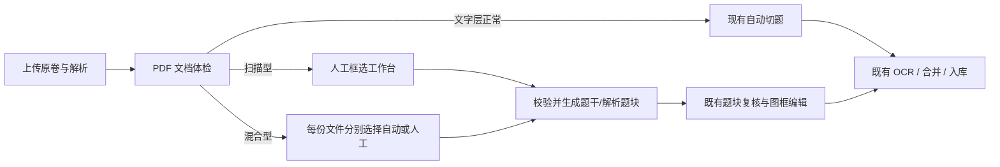

# 扫描型 PDF 人工框选切题与双文件配对方案

## 1. 背景与结论

当前 PDF 切题器依赖 PDF 文字层提取页面文字行，再以题号、章节标题和坐标作为题目锚点。它适合可复制文字的试卷、讲义和由 Word 导出的 PDF，但对“整页扫描图”型 PDF 无法产生可靠锚点。

以“云南师大附中 2026 届高考适应性月考卷（三）数学”及其答案版为例：

- 原卷共 6 页，答案版共 10 页。
- 两份文件的每页均只有一个覆盖整页的栅格图像对象。
- 每页仅约 58 个文字层字符，内容主要为页脚；没有可用于题号识别的正文文字层。
- 原卷与答案版是两个独立文件，题干和解析需要按题号关联。

因此，扫描件不应先进入现有自动切题任务再等待失败。系统应在上传后完成一次轻量的文档体检；确认是扫描型 PDF 后，直接进入人工框选工作台，由用户在原卷和答案版页面上标出题目区域，再复用现有的裁图、OCR、复核、题干-解析合并和入库链路。

本文件只规划设计，不修改当前实现。

## 2. 目标、范围与非目标

### 2.1 目标

- 自动识别文字层不足的扫描型 PDF，并阻止其进入文字锚点自动切题。
- 上传扫描型试卷后，自动打开一个支持缩放、翻页、连续滚动和框选的人工标注工作台。
- 支持原卷、答案/解析两个文件分别标注，并以用户确认的题号建立配对。
- 支持同一道题跨页，或同一题由多个不连续区域组成。
- 把人工标注生成的题块送入现有 OCR、题图复核、题目-解析匹配与待入库流程。
- 支持保存草稿、退出后继续、完成前校验，以及 OCR 开始后的版本可追溯。

### 2.2 本期范围

- PDF 上传后的扫描/文字/混合文档体检。
- 扫描型试卷的人工题干框选、人工解析框选和题号配对。
- 全页预览渲染、框选坐标保存、跨页裁图和生成现有 review item。
- 与现有“分离原卷 + 解析”上传模式的批次关联。
- 必要的状态、诊断信息、API、数据库迁移和测试。

### 2.3 非目标

- 本期不使用视觉模型自动识别扫描件的题号、题目边界或答案边界。
- 本期不尝试把整份扫描 PDF 先全文 OCR 后再依据 OCR 文本自动切题。
- 不替换现有的文字层自动切题算法；文字型 PDF 仍走原链路。
- 不在人工标注界面直接编辑 OCR 文本或题库字段。
- 不要求题干和答案必须一一存在；无解析的题目可正常进入题干 OCR，只给出告警。

## 3. 设计原则

1. **先判断，再分流**：扫描件应跳过文字锚点检测，不把可预期失败当成正常任务状态。
2. **人工确认优先**：扫描件的题号和边界以用户标注为准，不根据框选顺序或页码猜测配对关系。
3. **原始坐标可重建**：保存相对于 PDF 页面的归一化坐标，而非浏览器显示像素或一次性裁图坐标。
4. **原卷为主、解析独立**：题干题号作为主要序列；解析按同一题号附着，不以“第几个框”隐式匹配。
5. **最小新链路**：只新增扫描件的“标注 -> 生成题块”前段；后续继续使用既有的裁图、复核、OCR、合并和入库能力。
6. **草稿可恢复、结果不回写**：OCR 已启动的批次不可静默重写。重新框选必须形成新修订，保留旧结果供追溯。

## 4. 总体链路



### 4.1 状态流转

建议在现有 `pdf_slicer_runs.slice_status` 基础上扩展扫描件状态，并在批次层计算总体工作流状态。

| 状态 | 含义 | 可执行动作 |
| --- | --- | --- |
| `queued` | 文字型文件等待自动切题 | 自动或手动启动切题 |
| `profiling` | 正在读取 PDF 结构和生成首批预览 | 等待 |
| `awaiting_manual_annotation` | 已判定或用户选择人工框选 | 打开/继续标注、删除文件 |
| `annotating` | 存在人工标注草稿 | 保存、继续、完成标注 |
| `manual_ready` | 标注已完成，正在/已经生成题块 | 打开题块复核 |
| `succeeded` | 题块已生成并通过现有切题阶段 | 进入 OCR 或 JSON 导入 |
| `failed` | 体检、渲染、裁图或自动切题失败 | 查看诊断、重试或改走人工 |

`awaiting_manual_annotation` 和 `annotating` 不是错误，也不应被 OCR 队列统计为待 OCR。

### 4.2 分离原卷 + 解析的批次规则

当前上传页已经支持“分离原卷 + 解析”并赋予文件 `questions`、`solutions` 角色。本方案保持这个模型：

- 一个 `batch` 可以有一个原卷 run、一个答案 run，未来也可允许补传附加解析文件。
- 人工标注会话挂在 `batch` 上，区域仍明确指向具体 `source_run_id`。
- 原卷 `question` 区域建立题号主序列；答案 `solution` 区域按题号连接。
- 两个文件可分别进入自动或人工模式。例如原卷为扫描件、答案为可复制文字时，原卷人工框选、答案仍可自动切题。
- 题号匹配使用规范化题号，而不是列表索引；`1`、`01`、`第 1 题` 归入同一匹配键，但保留原始显示标签。

## 5. 文档体检与分流规则

### 5.1 采样指标

上传后由 Node 调用项目已依赖的 PyMuPDF 读取 PDF，不做 OCR。每页提取：

- `textChars`：文字层的非空字符数。
- `textBlocks` / `textLines`：文字块和文字行数量。
- `imageCount`：栅格图像对象数量。
- `maxImageCoverage`：最大图像占页面面积的比例。
- `drawingCount`：矢量绘制对象数量。
- 页面尺寸、页数和文件大小。

前端首屏预览图可以在此阶段一并渲染；后续页面延迟渲染并缓存。

### 5.2 初始判定规则

以下规则是可解释的初始阈值，实际以真实样卷回归后再调整：

| 分类 | 建议条件 |
| --- | --- |
| `scan` | 至少 80% 页面同时满足：正文文字少于 100 字、文字块不超过 3 个、且存在覆盖页面 80% 以上的大图。 |
| `text` | 至少 80% 页面有足以形成正文的文字行，且没有大图覆盖整页。 |
| `mixed` | 其余情况，例如部分扫描、部分文字，或文字与整页图并存。 |

体检结果应包括 `contentMode`、`confidence`、页级统计、判定原因和版本号，写入现有 `document_diagnostics_json`。判定低置信度时不自动阻塞，页面提供“按自动切题处理”与“改为人工框选”两个明确选择。

### 5.3 上传后的行为

1. 文件先安全落盘，创建 run 和 batch。
2. 完成文档体检后才决定是否启动现有 `startSlicingRunInBackground()`。
3. 对 `scan`：写入 `awaiting_manual_annotation`，不调用自动切题；上传 API 返回 `nextAction: manual_annotation`。
4. 前端收到该动作后，自动打开全屏标注工作台，而不是显示一个难以操作的小提示框。
5. 对 `mixed`：显示体检摘要和选择项。若用户选择人工，则同样不启动自动切题。
6. 对 `text`：保持当前无感自动切题体验。

## 6. 人工框选工作台

### 6.1 预览实现选择

使用后端 PyMuPDF 渲染的高清页面图片作为编辑底图，不在标注核心路径中嵌入原生 PDF 控件。理由：

- 扫描件本身已是图像，页面位图与用户看到的内容一致。
- 标注层和裁图层使用同一坐标映射，避免 PDF.js 缩放、旋转或 CSS 布局导致坐标漂移。
- 可复用现有 Python 渲染和裁图能力，且无需向前端暴露本地绝对文件路径。

页面仍应在界面上称为“PDF 页预览”，并提供页码、缩放、适宽、适页、旋转、上一页/下一页和连续滚动。

### 6.2 页面布局

桌面端使用全屏或接近全屏的对话框，避免在普通弹窗中挤压 A4 页面。

| 区域 | 内容 |
| --- | --- |
| 顶部工具栏 | 文件切换、缩放、适宽/适页、连续滚动、撤销/重做、保存草稿、完成框选。 |
| 左侧题目队列 | 题号、原卷状态、解析状态、跨页标记、匹配告警；可筛选“未完成”。 |
| 中部画布 | 原卷或答案 PDF 页预览，叠加可拖拽、缩放、删除的区域框。宽屏可切为原卷/答案双栏。 |
| 右侧属性栏 | 当前题号、区域类型、跨页 segments、备注、绑定题号、公共答案区关联范围。 |
| 底部状态栏 | 当前页、总页数、草稿保存状态、未配对数量、错误与告警摘要。 |

窄窗口下，原卷和答案使用页签切换；题号队列始终保留。

### 6.3 用户操作

#### 新建和编辑题干

1. 用户点击“新建题目”，系统建议下一个连续题号，例如 `5`；题号可编辑。
2. 在原卷页拖出一个框，系统将该区域加入当前题目的 `segments`。
3. 如果题目在下一页继续，用户点击“跨页继续”，翻页后继续添加 segment。
4. 同页的多个不连续区域也允许归入同一题，例如正文和下方独立题图。
5. 用户可移动、缩放、删除区域框；支持撤销/重做和自动保存草稿。

#### 标注解析与配对

1. 在题号队列中选择目标题目，例如 `第 5 题`。
2. 切换到答案文件，在解析页框选对应的答案/详解区域。
3. 解析框自动绑定当前题号，也可以在属性栏改绑至其他题号。
4. 若答案版的题号顺序与原卷不同，系统不按顺序强制配对，仅依据最终题号绑定。
5. 一题可有多个解析 segment，例如“答案表”与“详解正文”。

#### 公共答案区

某些答案版在页首给出统一选择题答案表，而每题详解在后续页面。为避免用户为每一题重复裁同一张表，支持标记 `shared_answer_key`：

- 用户框选一次答案表，填写其覆盖的题号范围或多选题号。
- 生成 OCR 任务时，该图片作为对应题目的补充答案来源，不替代该题的详细解析。
- 若一题只有公共答案表而无详解，仍可据此生成 `answerText`，解析字段保持为空并标注来源。

### 6.4 坐标模型

不保存浏览器像素坐标。每个 segment 使用相对于原始 PDF 页的归一化矩形：

```json
{
  "page": 6,
  "x": 0.0792,
  "y": 0.1264,
  "width": 0.8403,
  "height": 0.6791
}
```

规则：

- 坐标范围为 `0..1`，页面渲染 DPI 改变不会影响区域。
- 渲染和裁图时根据该页的实际 PDF `Rect` 还原为 PyMuPDF clip。
- 按 `page`、`y`、`x` 排序 segment；跨页题按用户添加顺序保留。
- 裁图边缘加入很小的安全留白，防止数学公式笔画被截断；留白由后端统一换算。

## 7. 数据模型

现有 `pdf_slicer_review_items` 已具备题号、bbox 和 segments 字段，适合承接最终的题干题块；但它不适合保存可恢复的编辑草稿，也不能完整表达答案侧原始区域。因此建议新增独立标注数据，再在“完成框选”时物化为现有结果。

### 7.1 `pdf_slicer_annotation_sessions`

| 字段 | 说明 |
| --- | --- |
| `id` | 标注会话 ID。 |
| `batch_id` | 所属上传批次。 |
| `revision` | 修订号；OCR 启动后重新框选必须新建修订。 |
| `status` | `draft`、`ready`、`finalized`、`superseded`。 |
| `source_profile_json` | 各 run 的扫描体检结果快照。 |
| `created_at` / `updated_at` / `finalized_at` | 审计时间。 |

### 7.2 `pdf_slicer_annotation_regions`

| 字段 | 说明 |
| --- | --- |
| `id` / `session_id` | 区域与标注会话。 |
| `source_run_id` | 原卷或答案文件对应的 run。 |
| `kind` | `question`、`solution`、`shared_answer_key`。 |
| `question_key` | 规范化匹配键，例如 `5`。公共答案区允许为空。 |
| `question_label` | 供界面显示的原始题号，例如 `第 5 题`。 |
| `question_keys_json` | 公共答案区关联的多个题号。 |
| `segments_json` | 归一化页区域列表，支持跨页和多块。 |
| `sort_order` / `note` | 人工排序与备注。 |
| `created_at` / `updated_at` | 审计时间。 |

### 7.3 结果物化

“完成框选”应在一个事务与可重试任务中执行：

1. 读取当前 session 的题干、解析和公共答案区域。
2. 用既有裁图能力生成题干图、解析图及跨页拼接图。
3. 题干区域写入 `pdf_slicer_review_items`，并标记来源 `manual_annotation`。
4. 解析区域写入 `pdf_slicer_solution_items`；需要为解析记录补充原始 `segments` 和来源信息，便于回溯和重新裁切。
5. 使用题号建立关联；公共答案区按关联题号附着为 OCR 的补充源。
6. 将 session 置为 `finalized`，run 置为 `manual_ready` 或现有成功状态。

对于未启动 OCR 的已完成 session，允许用户确认后重新物化并覆盖尚未处理的 review items。OCR 已启动后，界面只允许“创建新修订并重新处理”，不能原地修改历史 OCR 输入。

## 8. 后端 API 与任务设计

以下接口名称是建议，具体路由可沿用现有 `/api/tools/pdf-slicer` 结构。

| 方法 | 路径 | 用途 |
| --- | --- | --- |
| `GET` | `/runs/:runId/document-profile` | 读取页级文字/图片统计与分流结论。 |
| `POST` | `/runs/:runId/render-pages` | 触发或确保预览页缓存；首屏优先。 |
| `GET` | `/runs/:runId/pages/:page` | 返回安全的预览图 URL/二进制流。 |
| `POST` | `/batches/:batchId/annotation-sessions` | 创建或恢复当前草稿会话。 |
| `GET` | `/annotation-sessions/:sessionId` | 读取区域、匹配状态和可编辑草稿。 |
| `PUT` | `/annotation-sessions/:sessionId/regions` | 批量保存区域草稿，携带乐观锁 revision。 |
| `POST` | `/annotation-sessions/:sessionId/validate` | 校验题号、空区域、解析配对和越界坐标，不写结果。 |
| `POST` | `/annotation-sessions/:sessionId/finalize` | 锁定本修订，生成题干/解析题块。 |
| `POST` | `/annotation-sessions/:sessionId/revise` | 已处理结果需要重框时创建下一修订。 |

### 8.1 上传 API 的变化

上传接口的响应增加非破坏性字段：

```json
{
  "batchId": "batch_xxx",
  "runIds": ["run_questions", "run_solutions"],
  "runs": [],
  "nextAction": "manual_annotation",
  "manualAnnotationBatchId": "batch_xxx"
}
```

现有调用方未读取这些字段时仍可正常处理上传响应。前端上传页读取 `nextAction`，在上传成功后自动打开标注工作台。

### 8.2 渲染与缓存

- 页面预览存放在对应 run 的 `output/annotation-pages/` 下，不覆盖现有自动切题生成物。
- 按需生成：先渲首两页，用户翻页时再生成后续页；预取相邻页。
- 预览图与裁图共享原始 PDF，不共享预览像素坐标。
- 文件删除、run 删除或新修订替换后清理无引用的预览缓存。

## 9. 与现有切题与 OCR 的衔接

### 9.1 保持的现有能力

- 分离原卷/解析上传及 batch 关联。
- 原卷题块的图像裁切、跨页拼接和题图框编辑。
- `SliceReviewDialog` 中的删除、拆分、合并、题号重命名和题图复核。
- OCR 队列、单题重跑、答案/解析按题号合并、待入库页面。

### 9.2 新增的适配层

- 文档体检：扩展当前 `extractPdfTextSample()` 的单一文本采样，输出结构化 profile。
- 人工标注裁图：复用 `crop_questions.py` 的 PyMuPDF clip 与拼接逻辑，但输入直接来自标注区域，不调用 `detect_question_anchors()`。
- 解析区域：为人工来源保留 segments、公共答案来源和匹配诊断，避免答案图只剩最终 PNG 而无法重新定位。
- 诊断：在 `document_diagnostics_json` 与 session 内记录 `contentMode`、阈值、人工模式原因、题干/解析/未配对计数和裁图警告。

### 9.3 复核入口

人工标注完成后仍进入现有题块复核页，但采用更轻的默认体验：

- 默认显示“人工框选结果”，重点提示未配对、跨页、裁图边缘异常和公共答案区。
- 不再把“全部选择题块”当成核心操作，因为题块已经由用户明确创建。
- 用户可继续使用现有拆分、合并和图框编辑能力。
- 确认提交后才进入 OCR，避免不完整草稿进入任务队列。

## 10. 校验、异常与恢复

### 10.1 完成框选前校验

阻断性错误：

- 没有任何原卷题干区域。
- segment 页码不存在、坐标超出 `0..1`、宽高为零。
- 同一题号在同一文件角色下出现无法区分的重复主区域。
- 当前会话已被其他窗口更新，乐观锁版本冲突。

非阻断告警：

- 题号不连续，例如有 `1, 2, 4` 而无 `3`。
- 原卷题目没有解析区域。
- 解析区域未绑定任何原卷题目。
- 两个区域高度重叠，可能重复框选。
- 公共答案区覆盖的题号不存在。

用户可在确认告警后完成框选；系统应把确认行为和告警快照写入诊断。

### 10.2 失败恢复

- 页面预览渲染失败：保留草稿，可单页重试；不丢弃已保存的区域。
- 裁图失败：标出具体题号和页码，允许重新裁图，不重新做整份标注。
- 浏览器关闭：自动保存的草稿在下次打开同 batch 时恢复。
- OCR 前重新框选：确认后覆盖当前未处理的物化结果。
- OCR 后重新框选：创建新修订和新的处理批次，旧 OCR 结果保持可追溯。

## 11. 安全与性能

- 页面预览和裁图接口必须按 run/session 授权解析服务器存储路径，前端不得接收或拼接本地绝对路径。
- 限制单页预览分辨率和并行渲染数，防止高分扫描件造成内存峰值。
- 保存时限制单个区域最小面积、最大 segment 数和每会话最大题块数，避免异常 JSON 或误操作。
- 大文件上传后优先渲染当前页和相邻页，后台慢速预取，不阻塞框选。
- 所有坐标和文件名在服务端校验，裁图 clip 必须限制在 PDF 页范围内。

## 12. 实施分期

### 第一阶段：识别和安全分流

1. 增加 PDF 文档体检和 `document_diagnostics_json` 结构。
2. 增加 `scan / text / mixed` 判定与人工覆盖选项。
3. 扫描件上传后不自动启动文字锚点切题。
4. 在上传页和 run 卡片展示“等待人工框选”及体检原因。

### 第二阶段：单文件人工框选闭环

1. 新增标注 session 和 region 表。
2. 新增全页预览、框选、草稿保存、跨页 segment 和完成校验。
3. 从人工区域生成 `pdf_slicer_review_items` 和裁图。
4. 将结果接入现有题块复核和 OCR。

### 第三阶段：分离原卷 + 解析配对

1. 在同一工作台支持原卷与答案切换或双栏显示。
2. 以题号建立题干-解析关系，显示未匹配状态。
3. 支持公共答案区并作为多个题目的 OCR 补充来源。
4. 完成答案侧区域的审计、重新裁图和 OCR 输入组装。

### 第四阶段：效率增强，不作为前置依赖

- 使用视觉/OCR 模型提出候选题号与候选边界，用户一键接受或调整。
- 从题干题号识别结果预填题号。
- 对答案表做结构化识别并建议关联范围。
- 保存常用试卷模板的页眉页脚排除区域。

## 13. 验收标准

以本次云南师大附中两份数学 PDF 为回归样例：

- 上传后被稳定识别为扫描型，不启动现有文字锚点自动切题。
- 上传成功后自动进入人工框选工作台，能够预览原卷 6 页和答案 10 页。
- 用户可框选原卷第 1 至第 19 题；第 19 题等末页大题可完整裁出。
- 支持至少一道跨页题以多个 segment 保存并正确拼接。
- 用户可对答案版按题号标注解析，系统能明确展示已匹配、缺题干、缺解析和重复题号。
- 标注草稿关闭后可恢复，不丢失区域和题号。
- 完成框选后生成的题干/解析图可进入现有复核与 OCR，不需要修改 OCR 主流程。
- 改变预览缩放、窗口尺寸和渲染 DPI 后，最终裁图边界保持一致。
- OCR 已启动后，重新框选不会静默覆盖历史输入或结果。

## 14. 测试计划

### 单元测试

- 文档 profile：纯文字、纯扫描、混合、空白页、含页脚文字的扫描件。
- 题号规范化：`1`、`01`、`第 1 题`、`1.` 的匹配一致性。
- 归一化坐标与 PDF clip 双向换算、边界截断、跨页排序。
- session 草稿保存、乐观锁冲突、完成校验和修订创建。
- 公共答案区的题号关联与 OCR 输入展开。

### 集成测试

- 上传扫描型原卷和解析后，确保未调用自动切题后台任务。
- 人工区域物化后，验证题干 review item、解析 item、生成图片路径和题号匹配。
- 单文件人工标注、双文件人工标注、原卷人工 + 答案自动三种组合。
- OCR 前重框覆盖与 OCR 后新修订的隔离。

### 人工验收

- 使用鼠标和触控板完成画框、拖动、缩放、翻页、撤销、恢复草稿。
- 在不同窗口宽度、暗色模式及高 DPI 显示器上核对区域叠加与最终裁图。
- 审核易错场景：答案表、跨页大题、题图独立区域、题号顺序不一致、无解析题。

## 15. 已确认产品决策

1. 高置信度扫描件上传成功后，系统自动打开人工框选工作台；用户可以关闭并在之后从批次卡片继续。
2. 完成框选前不要求每道原卷题都有解析。缺解析为强提示，用户确认后仍可继续生成题干题块并进入 OCR。
3. 首期纳入公共答案表的最小支持：可一次框选，并关联多个题号作为对应题目的补充答案来源。
4. OCR 已启动后如需重新框选，系统创建新的标注修订和新的处理 run；旧 run、旧 OCR 输入与结果只读保留，用于审计与回溯，不会被新修订覆盖。
